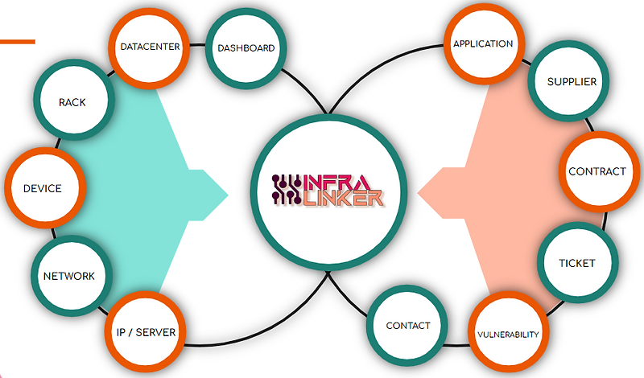

# InfraLinker Project

**Visit Website [infralinker.net](https://www.infralinker.net).**

## Want to explore? 
Check out our public demo right now! : [demo.infralinker.net](https://demo.infralinker.net).

__Login__ : demo@infralinker.net
__Password__ : Demo12345

## Introduction

Welcome to InfraLinker, the comprehensive DataCenter infrastructure assets management Solution. Our software has been designed to help you link your DataCenter Infrastructure, server racks, VLANs / IPs, Suppliers, devices, applications, vulnerabilities, and external tickets with ease and efficiency. The InfraLinker software is a flexible tool that can help you quickly and easily configure, manage, and visualize your DataCenter infrastructures. With its intuitive user interface, you can easily create, update, and delete server racks, Network/IP, suppliers, devices, applications, and vulnerabilities, and provides you with an easy-to-use ticketing system that helps you keep track of external tickets and ensure that they are addressed in a timely manner. This helps you streamline your Infrastructure and ensure that any issues that arise are addressed quickly and efficiently.

## About infralinker

InfraLinker is a modern data center infrastructure assets management solution designed to make managing and tracking your data center assets easier and more efficient. We provide a centralized database that helps eliminate common errors and data leaks associated with traditional methods such as spreadsheets and text documents.

Our intuitive and secure platform allows users to take control of their infrastructure, making it easier to manage and track all their assets. Our primary goal is to help businesses streamline their operations and gain better visibility into their data center infrastructure.

- __01 / Data Accuracy__
With a centralized database, all data is stored in one place, reducing the chances of errors and inconsistencies. This ensures that the data is up-to-date, accurate, and readily available to all authorized users.

- __02 / Increased Productivity__
By having all data in one place, users can access the information they need quickly and efficiently. This eliminates the need for manual data entry, freeing up valuable time and resources.

- __03 / Better Collaboration__
The centralized database allows multiple users to access the same information and collaborate on projects. This enhances collaboration, reducing the likelihood of delays and mistakes.

- __04 / Enhanced Security__
Centralized database offers better security than traditional methods of management. All data is stored in a secure environment, reducing the risk of data loss or theft.

- __05 / Scalability__
As the needs of your DataCenter change, the centralized database can be scaled to accommodate the growth. This ensures that the system remains relevant and effective, even as the size of the DataCenter expands.

## Key Features

InfraLinker was built specifically to serve the needs of IT engineers and operators. Below is a very brief overview of the core features it provides.

* Datacenters Management.
* Racks Management with an overview of installed devices.
* Devices Management with device details and reports.
* Device Roles Management.
* Networks and VLANs Management.
* IP Address and Server Management with full IPv4/IPv6 parity.
* Applications Management with open ports in each application.
* Projects and Tasks Management.
* Project Documents Management.
* External Tickets Management.
* Vulnerabilities Management.
* Suppliers and Contacts Management.
* Maintenance Contracts Management.
* Departments Management.
* Users and Roles Management.
* Tags Management.
* Detailed, automatic change logging.
* Email notifications for any new/closed tickets, vulnerabilities, or contracts.
  
## Screenshots ##

## 🤝 Contributing ##

Contributions are welcome! Here’s how you can help:
- Fix bugs
- Add new features
- Improve the documentation

Please make sure to read [CONTRIBUTING.md](./CONTRIBUTING.md) before getting started.

If you’re a beginner, look for issues labeled **good first issue**.

Feel free to open an issue for any suggestion! 🚀